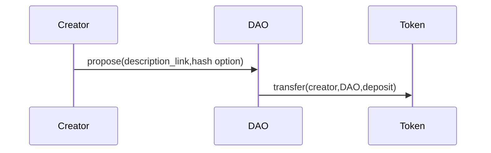
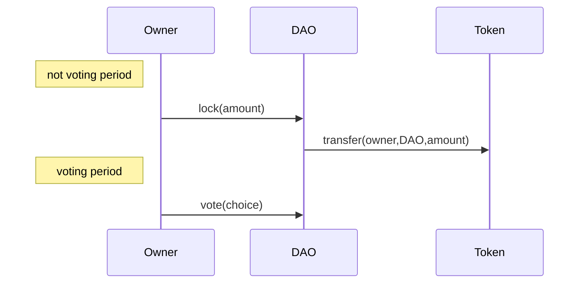
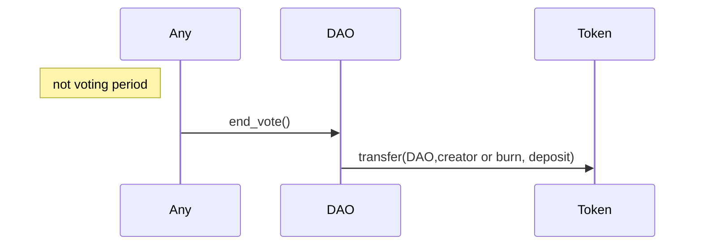
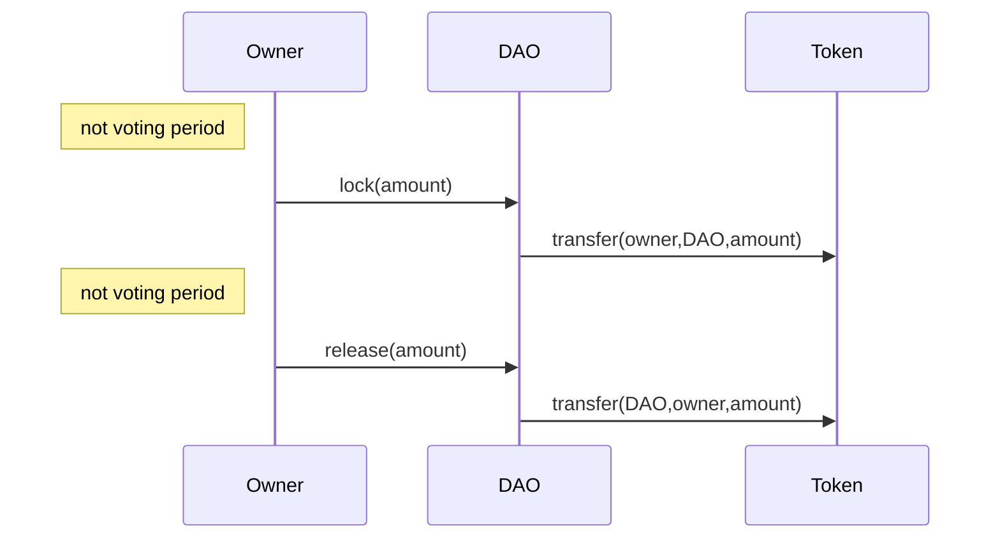
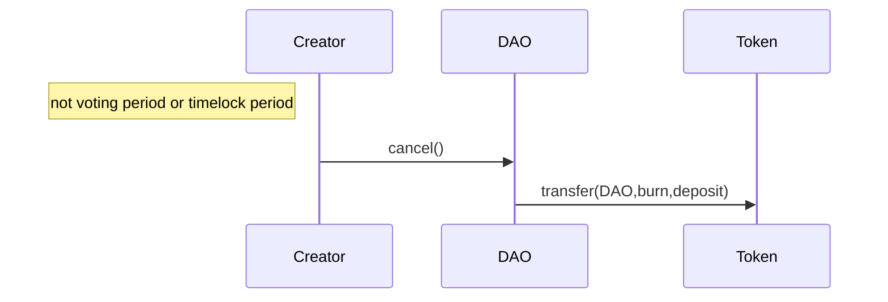
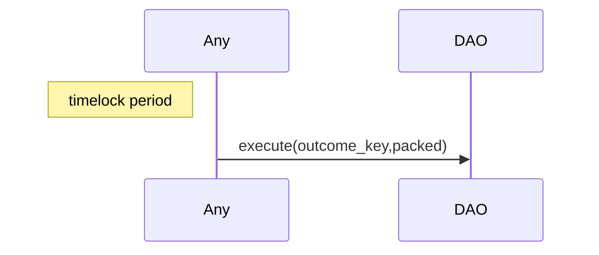

# Specification

## Workflow

The contract is using locked tokens of the configured
***governance_token*** as voting power.  
The potential incentives to lock tokens (outside of getting voting power) is
uncovered.

## Propose

A token owner can *propose* a vote by supplying a ***description_link***,
and an optional hash.  
As SPAM protection mechanism, the configured ***deposit_amount*** of tokens is
transferred from the owner to the DAO. This amount will be sent back to
the proposal creator if configured ***refund_threshold*** participation is
reached by the end of the vote.

## Lock / Vote

To convert their tokens to voting power, owners can *lock* them.
The lock mechanism consists in a transfer from the owner to the DAO contract address,
and tracking the balance of locked tokens in the storage.
Locking can only be done outside ***voting periods***.

After a configured ***start_delay*** elapsed time, token owners can *vote*
during a configured ***voting_period***. Token owners can vote on the proposal,
having their locked tokens being counted as voting power.

## End_vote

After the ***voting_period*** has elapsed, anyone can *end_vote*.
The vote result is computed, according to configured ***quorum_threshold***
and ***super_majority***, either the proposal is ***Accepted***,
and a timelock is created, or the proposal is **Rejected**.
When Rejected, The ***deposit_amount*** is either sent back to the proposal
creator or burned if the ***quorum_threshold*** haven't been met.

## Release

Token owners can also *release* their tokens, then the DAO contract
transfers locked token and updates the vault balance. Releasing can only be done
outside ***voting periods***.

## Cancel

The proposal creator can *cancel* the proposal outside the ***voting_period***
or the ***timelock_period***. The ***deposit_amount*** is burned.

### Execute

After a ***timelock_delay*** and for a ***timelock_period***, anyone can *execute*
a given lambda if it matches the hash associated to the proposal.

